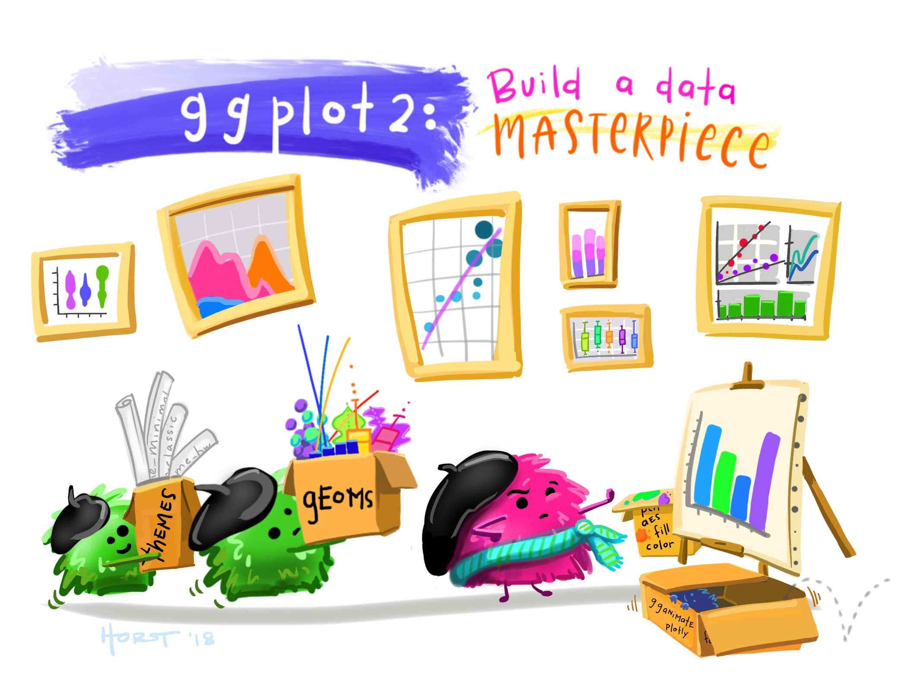

```{=html}
<style>
body{
text-align: justify}
</style>
```

**Deden Istiawan**


- deden.istiawan@itesa.ac.id
- [\@dedenistiawan](https://twitter.com/dedenistiawan)

```{r, echo=FALSE, out.width="70%", fig.align = "left", fig.cap = "Ilustrasi ggplot2"}
 
```

# Pengantar

Selamat datang di mata kuliah Visualisasi Data dengan `ggplot2`

Dalam mata kuliah ini, kita akan membahas konsep dan keterampilan untuk membuat visualisasi data yang efektif menggunakan `ggplot2` di R. Kita akan memulai dengan mereview dasar-dasar ggplot, kemudian memperdalam kemampuan dengan membuat grafik (termasuk penyesuaian skala, tema, pelabelan langsung, dsb) sambil memperkuat prinsip-prinsip visualisasi data dengan mempertimbangkan dengan cermat alasan kita mengubah (atau tidak mengubah) setiap komponen grafik. Selanjutnya, kita akan belajar membuat beberapa jenis grafik modern dan menarik yang jarang digunakan, sebelum menggabungkannya menjadi gambar gabungan menggunakan paket `patchwork`. Sebagai penutup, kita akan membangun sebuah peta dengan menggunakan ggplot, untuk memperkuat pemahaman bahwa alat dan konsep yang dipelajari dapat diterapkan pada berbagai jenis data dan visualisasi.

Mahasiswa harus dapat:

- Menginstal dan memasang paket R
- Membuat grafik `ggplot2` dasar dalam R
- Bekerja dengan nyaman dalam skrip R atau R Markdown

## Outline Dataviz

Berikut adalah beberapa hal yang akan dipelajari pada mata kuliah visualisasi data dengan `ggplot2` di R:  

Mata kuliah ini dirancang untuk memberikan pemahaman mendalam tentang hierarki konseptual dalam visualisasi data serta keterampilan praktis dalam menggunakan `ggplot2` di R. Topik-topik yang akan dibahas meliputi:  

1. Dasar-dasar `ggplot2` 
   - Pemetaan estetika (aesthetic mapping)  
   - Tema dan penyesuaiannya  
   - Penambahan label  
   - Fitur facet (termasuk perbandingan antara facet grid dan facet wrap)  
   - Mengatur urutan elemen data (misalnya, dengan `fct_reorder`)  

2. Kustomisasi Lanjutan di `ggplot2`  
   - Menggunakan `scales` untuk menentukan jeda dan label yang bermakna  
   - Skema warna yang menarik (dengan tambahan dukungan dari `paletteer`)  
   - Detail tema: garis kisi, warna panel, margin, dan lainnya  
   - Anotasi langsung sebagai alternatif legenda  
   - Label yang tidak saling bertumpuk dengan `ggrepel`  
   - Penyorotan elemen data untuk meningkatkan kejelasan menggunakan `gghighlight`  

3. Membuat gambar Komposit dengan `patchwork`  
   Memanfaatkan paket `patchwork` untuk menggabungkan berbagai grafik menjadi satu tata
   letak yang menarik.  

4. Jenis Grafik Baru yang Layak Dicoba 
   - Plot marginal untuk menunjukkan distribusi tambahan  
   - Beeswarm plots dengan `ggbeeswarm`  
   - Heatmap dengan `geom_tile()`  
   - Membuat peta yang menarik menggunakan `ggplot2`  

5. Ekspor dan Penyimpanan Grafik
   Teknik dan praktik terbaik untuk menyimpan hasil visualisasi Anda dengan kualitas
   tinggi.  

Mata kuliah ini akan membantu mahasiswa memahami prinsip-prinsip visualisasi data yang baik sekaligus menguasai alat-alat yang diperlukan untuk membuat grafik yang elegan dan bermakna.  

# Referensi dan data

## R packages

Terima kasih yang sebesar-besarnya kepada para pengembang, kontributor, pengajar, dan seluruh komunitas R atas kontribusi luar biasa dalam membangun alat, menciptakan sumber daya, dan menciptakan lingkungan yang mendukung untuk belajar. Upaya kolektif Anda memungkinkan kami untuk terus mengeksplorasi dan berkembang dalam bidang visualisasi data.

Ucapan terima kasih khusus ditujukan kepada para pengembang dan pemelihara paket R berikut yang sangat penting dalam perjalanan pembelajaran ini:

- `tidyverse`: Wickham et al., (2019). Welcome to the tidyverse. Journal of
  Open Source Software, 4(43), 1686,
  https://doi.org/10.21105/joss.01686
- `ggplot2`: H. Wickham. ggplot2: Elegant Graphics for Data Analysis. Springer-Verlag New
  York, 2016.
- `ggrepel`: Kamil Slowikowski (2021). ggrepel: Automatically Position Non-Overlapping Text
  Labels with 'ggplot2'. R package version 0.9.1.
  https://github.com/slowkow/ggrepel
- `gghighlight`: Hiroaki Yutani (2020). gghighlight: Highlight Lines and Points in 'ggplot2'. R
  package version 0.3.1. https://github.com/yutannihilation/gghighlight/
- `R Markdown`: Yihui Xie and J.J. Allaire and Garrett Grolemund (2018). R Markdown: The
  Definitive Guide. Chapman and Hall/CRC. ISBN 9781138359338. URL
  https://bookdown.org/yihui/rmarkdown.
- `sf`: Pebesma, E., 2018. Simple Features for R: Standardized Support for Spatial Vector
  Data. The R Journal 10 (1), 439-446, https://doi.org/10.32614/RJ-2018-009
- `paletteer`: See AUTHORS file. (2021). paletteer: Comprehensive Collection of Color Palettes. R package version 1.3.0. https://github.com/EmilHvitfeldt/paletteer
- `gapminder`: Jennifer Bryan (2017). gapminder: Data from Gapminder.
  https://github.com/jennybc/gapminder, http://www.gapminder.org/data/,
  https://doi.org/10.5281/zenodo.594018.
- `janitor`:Sam Firke (2021). janitor: Simple Tools for Examining and Cleaning Dirty Data. R
  package version 2.1.0. https://github.com/sfirke/janitor
  

## Data Praktikum

Data yang digunakan dari [Jornada Basin Long Term Ecological Research site](https://lter.jornada.nmsu.edu/) di New Mexico, bagian dari jaringan US Long Term Ecological Research (LTER):  

- Lightfoot, D. dan W.G. Whitford. 2020. Data jebakan kadal di 11 lokasi studi NPP di situs Jornada Basin LTER, 1989-2006 versi 37. Environmental Data Initiative. https://doi.org/10.6073/pasta/4a6e258fb49c31e222ecbbcfd128967f  

Dari paket data tersebut:  
"Paket data ini mencakup data tentang kadal yang diambil dari jebakan di 11 plot konsumen di situs Jornada Basin LTER dari tahun 1989-2006. Tujuan penelitian ini adalah untuk mengamati bagaimana pergeseran vegetasi akibat proses desertifikasi di Gurun Chihuahuan telah mengubah ketersediaan sumber daya bagi konsumen secara spasial dan temporal. Perubahan desertifikasi di Jornada Basin meliputi peralihan dari padang rumput ke komunitas yang didominasi oleh semak dan perubahan besar pada tanah. Jika sistem padang rumput merespons hujan tanpa penundaan yang signifikan, sementara sistem semak tidak, maka spesies konsumen seharusnya mencerminkan perbedaan ini. Selain itu, pergeseran dari padang rumput ke semak menyebabkan heterogenitas struktural yang lebih besar pada habitat. Kami berhipotesis bahwa populasi, keanekaragaman, dan kepadatan beberapa konsumen akan lebih tinggi di padang rumput dibandingkan di semak belukar, serta berkorelasi dengan NPP (Net Primary Productivity) dari lokasi penelitian. Kadal ditangkap menggunakan jebakan di 11 plot konsumen LTER II/III (subset dari plot NPP) setiap tiga bulan selama 2 minggu setiap kuartal. Variabel yang diukur meliputi spesies, jenis kelamin, status penangkapan ulang, panjang moncong-ventral, panjang total, berat badan, dan kondisi ekor (patah atau utuh). Penelitian ini telah selesai."  

Terdapat total 16 variabel dalam data `lizards.csv` yang akan kita baca. Variabel-variabel yang akan digunakan dalam workshop ini adalah:  

- **`date`**: tanggal pengumpulan data  
- **`scientific_name`**: nama ilmiah kadal  
- **`common_name`**: nama umum kadal  
- **`site`**: kode lokasi penelitian  
- **`sex`**: jenis kelamin kadal (`m` = jantan; `f` = betina; `j` = juvenil)  
- **`sv_length`**: panjang moncong ke ventral (dalam milimeter)  
- **`total_length`**: panjang tubuh (dalam milimeter)  
- **`toe_num`**: nomor penanda pada jari kaki  
- **`weight`**: berat tubuh (dalam gram)  
- **`tail`**: kondisi ekor (`b` = patah; `w` = utuh)  

## Data Spasial Vegetasi Jornada  

Data ini berasal dari [Jornada Basin LTER Spatial Data](https://lter.jornada.nmsu.edu/spatial-data/): **Vegetasi Dominan di JER dan CDRRC tahun 1998**. Data ini memuat informasi tentang vegetasi dominan dan subdominannya di **Jornada Experimental Range (JER)** dan **Chihuahuan Desert Rangeland Research Center (CDRRC)** pada tahun 1998.  

Data ini diterbitkan dalam:  
Gibbens, R. P., McNeely, R. P., Havstad, K. M., Beck, R. F., & Nolen, B. (2005). Vegetation changes in the Jornada Basin from 1858 to 1998. *Journal of Arid Environments, 61*(4), 651-668.  

## Membuat Dokumen R Markdown Baru atau Skrip R  

Saya akan menggunakan **R Markdown** selama perkuliahan, tetapi Anda dapat mengikuti workshop ini baik dengan **file .Rmd** maupun **skrip R (.R)**.  

## Install R packages

```{r setup, include = FALSE}
knitr::opts_chunk$set(echo = TRUE, message = FALSE, warning = FALSE)
```

```{r}
library(tidyverse)
library(here)
library(janitor)

library(patchwork)
library(ggrepel)
library(gghighlight)
library(paletteer)
library(ggExtra)
library(ggbeeswarm)

# Spatial data
library(sf)

library(gapminder)

```

## Read lizard data

```{r}
lizards <- read_csv(here("data_tidy", "lizards.csv"))
```


# Dasar-Dasar `ggplot2`

`ggplot2` adalah library visualisasi data populer di R, berdasarkan Grammar of Graphics. Library ini menyediakan cara yang kuat dan fleksibel untuk membuat berbagai jenis plot.

Ketika kita mulai membuat grafik dengan `ggplot2`, kita memerlukan tiga blok bangunan dasar:

- **`Menggunakan `ggplot2`**: Kita harus memulai dengan memanggil fungsi ggplot() untuk membuat objek ggplot baru.
- **`Data yang digunakan`**: Kita harus menentukan data yang ingin kita gunakan dalam grafik kita. Data ini biasanya dalam bentuk data frame.
- **`Jenis grafik`**: Kita harus menentukan jenis grafik yang ingin kita buat, seperti plot titik, plot garis, plot batang, atau histogram.

## Komponen Dasar

Plot `ggplot2` terdiri dari komponen-komponen dasar berikut:

- **`Data`**: Data yang akan diplot, biasanya dalam bentuk data frame.
- **`Aesthetics`**: Properti visual plot, seperti warna, bentuk, dan ukuran.
- **`Geoms`**: Objek geometris yang membentuk plot, seperti titik, garis, dan batang.
- **`Scales`**: Skala yang digunakan untuk memetakan data ke aesthetics.
- **`Facets`**: Cara untuk membagi data menjadi beberapa plot.

## Contoh Code
Berikut adalah contoh membuat plot titik sederhana menggunakan `ggplot2`:

```{r}
# Muat library ggplot2
library(ggplot2)

# Buat data frame contoh
data <- data.frame(x = rnorm(100), y = rnorm(100))

# Buat plot titik
ggplot(data, aes(x = x, y = y)) +
  geom_point()
```

## Custom Plot
Anda dapat mengkustomisasi plot dengan menambahkan lapisan tambahan, seperti:

- **`labs()`**: Menambahkan label ke plot.
- **`theme()`**: Mengubah tampilan keseluruhan plot.
- **`scale_color_manual()`**: Mengatur skala warna secara manual.

Berikut adalah contoh mengkustomisasi plot:

```{r}
# Buat plot titik dengan label dan tema kustom
ggplot(data, aes(x = x, y = y)) +
  geom_point() +
  labs(title = "Plot Titik", x = "Sumbu X", y = "Sumbu Y") +
  theme_classic()
```

## Faceting

Faceting memungkinkan Anda untuk membagi data menjadi beberapa plot berdasarkan variabel kategorik. Berikut adalah contoh faceting:

```{r}
# Buat data frame contoh dengan variabel kategorik
data <- data.frame(x = rnorm(100), y = rnorm(100), grup = sample(c("A", "B"), 100, replace = TRUE))

# Buat plot titik dengan faceting
ggplot(data, aes(x = x, y = y)) +
  geom_point() +
  facet_wrap(~ grup)
```

## Read lizard data
Berikut ini merupakan contoh penggunaan library `ggplot2` dengan menggunakan data `lizards.csv`.

```{r}
lizards <- read_csv(here("data_tidy", "lizards.csv"))
```

## Tiga Cara untuk Membuat Grafik dengan `ggplot2`

Kita dapat membuat grafik dengan `ggplot2` menggunakan tiga cara yang berbeda, namun memiliki hasil yang sama. Berikut adalah contoh-contoh tersebut:

Cara 1:
Dalam cara ini, kita menentukan data dan aesthetics (aes) langsung dalam fungsi `ggplot()`, kemudian menambahkan geom (dalam hal ini, `geom_point()`).

```{r}
# cara 1
ggplot(data = lizards, aes(x = total_length, y = weight)) +
  geom_point()
```

Cara 2:
Dalam cara ini, kita menentukan data dalam fungsi `ggplot()`, kemudian menambahkan geom dan aesthetics dalam fungsi `geom_point()`.

```{r}
ggplot(data = lizards) +
  geom_point(aes(x = total_length, y = weight))
```

cara 3:
Dalam cara ini, kita tidak menentukan data dalam fungsi `ggplot()`, melainkan menentukannya dalam fungsi `geom_point()` bersama dengan aesthetics.

```{r}
ggplot() +
  geom_point(data = lizards, aes(x = total_length, y = weight))
```

Ketiga cara di atas memiliki hasil yang sama, yaitu membuat grafik titik dengan data `lizards` dan menggunakan `total_length` sebagai sumbu x dan `weight` sebagai sumbu y. Namun, perlu diingat bahwa cara pertama adalah cara yang paling umum digunakan dan direkomendasikan.

## Mengubah Jenis Grafik dengan Mudah
Dengan menggunakan salah satu dari tiga cara yang disebutkan sebelumnya, kita dapat dengan mudah mengubah jenis grafik hanya dengan mengupdate `geom_`. Berikut adalah contoh:

```{r}
ggplot(data = lizards, aes(x = total_length, y = weight)) +
  geom_line() # sekedar contoh mengubah jenis grafik
```

**Grafik yang Hanya Memerlukan Satu Variabel**
Beberapa jenis grafik hanya memerlukan satu variabel, seperti `geom_histogram`. Berikut adalah contoh:

```{r}
ggplot(data = lizards, aes(x = total_length)) +
  geom_histogram()
```

## Memilih Grafik Berdasarkan Jenis Data

Saat memilih jenis grafik, penting untuk mempertimbangkan jenis data yang akan divisualisasikan. Berikut adalah beberapa contoh:

**Data Kategorik dan Kontinu:** Jitterplot biasanya digunakan untuk memvisualisasikan data dengan satu variabel kategorik dan satu variabel kontinu.

```{r}
ggplot(data = lizards, aes(y = common_name, x = total_length)) +
  geom_jitter()
```

Dalam contoh di atas, `common_name` adalah variabel kategorik dan `total_length` adalah variabel kontinu.

**Data Kontinu:** Histogram dan grafik densitas biasanya digunakan untuk memvisualisasikan data dengan satu variabel kontinu.

```{r}
ggplot(data = lizards, aes(x = total_length)) +
  geom_histogram()
```

Dalam contoh di atas, `total_length` adalah variabel kontinu.

**Data Kategorik:** Grafik batang biasanya digunakan untuk memvisualisasikan data dengan satu variabel kategorik.

```{r}
ggplot(data = lizards, aes(y = common_name)) +
  geom_bar()
```

Dalam contoh di atas, jenis_lizard adalah variabel kategorik.

**Data Kontinu dengan Waktu:** Grafik garis biasanya digunakan untuk memvisualisasikan data dengan satu variabel kontinu yang terkait dengan waktu.

```{r}
ggplot(data = lizards, aes(x = date, y = total_length)) +
  geom_line()
```

Dalam contoh di atas, `date` adalah variabel kontinu yang terkait dengan waktu dan `total_length` adalah variabel kontinu.

**Tidak yakin jenis grafik yang tepat untuk data Anda?** Referensi favorit saya adalah Yan Holtz' [From Data to Viz](https://www.data-to-viz.com/) dan contoh kode dari [R Graph Gallery](https://www.r-graph-gallery.com/).

## Aesthetic mapping

### Mengupdate Berdasarkan Konstanta? Tidak Perlu `aes()`!
Untuk mengubah estetika grafik berdasarkan konstanta (misalnya, "Buat semua titik berwarna BIRU"), kita dapat menambahkan informasi langsung ke lapisan `geom_` yang relevan. Berikut beberapa hal yang perlu diingat: 

- `fill`: mengupdate warna isi (misalnya, isi kolom, densitas, biola, dan kotak plot)
- `color`: mengupdate warna titik dan garis batas (umumnya)
- `shape`: mengupdate gaya titik
- `alpha`: mengupdate transparansi  (0 = transparent, 1 = opaque)
- `size`: ukuran titik atau lebar garis
- `linetype`: mengupdate jenis garis (misalnya, "titik-titik", "garis putus-putus", "titik-garis", dll.)

Jika Anda mengupdate nilai-nilai ini dengan merujuk pada nilai konstanta, maka **idak perlu menggunakan `aes()`**. 

For example, let's make some nightmares: 

```{r}
ggplot(data = lizards, aes(x = weight)) +
  geom_histogram(color = "orange", 
                 fill = "purple", 
                 size = 2, 
                 linetype = "dotted")
```

Contoh:

```{r}
ggplot(data = lizards, aes(x = total_length, y = weight)) +
  geom_point(color = "blue", size = 2, shape = 16)
```

Contoh:

```{r}
ggplot(data = lizards, aes(x = total_length, y = weight)) +
  geom_point(color = "cyan4", 
             fill = "yellow",
             shape = 22, 
             size = 3, 
             alpha = 0.4)
```

### Mengupdate Estetika Berdasarkan Variabel dengan `aes()`!

Jika Anda ingin memetakan variabel ke estetika grafik (misalnya, warna titik harus berdasarkan *jenis lizard*), maka masukkan variabel tersebut dalam `aes()`. 

```{r}
ggplot(data = lizards, aes(x = total_length, y = weight)) +
  geom_point(aes(color = common_name, size = total_length))
```

Dalam contoh di atas, kita memetakan variabel *jenis_lizard* ke estetika warna titik menggunakan `aes()`. Ini berarti bahwa warna titik akan berbeda-beda tergantung pada *jenis lizard*.

Dengan menggunakan `aes()`, kita dapat membuat grafik yang lebih informatif dan menarik, karena kita dapat memvisualisasikan hubungan antara variabel-variabel yang berbeda.

### Menggunakan Kombinasi Estetika
Estetika-estetika ini dapat digunakan dalam kombinasi. Misalnya, jika kita ingin warna titik berdasarkan *jenis lizard*, tetapi transparansi untuk semua titik adalah 0.3:

```{r}
ggplot(data = lizards, aes(x = total_length, y = weight)) +
  geom_point(aes(color = common_name), alpha = 0.3)
```

Dalam contoh di atas, kita memetakan variabel jenis_lizard ke estetika warna titik menggunakan `aes()`, dan kemudian kita menambahkan transparansi 0.3 untuk semua titik menggunakan alpha = 0.3. Ini berarti bahwa semua titik akan memiliki transparansi yang sama, tetapi warna titik akan berbeda-beda tergantung pada *jenis lizard*.

Dengan menggunakan kombinasi estetika, kita dapat membuat grafik yang lebih kompleks dan menarik, serta memvisualisasikan hubungan antara variabel-variabel yang berbeda.

## Themes/Tema

Ada beberapa tema bawaan yang dapat Anda tambahkan dengan `+ theme_*()`. 

Beberapa tema dasar yang berguna adalah: 

- `theme_minimal()`: tema minimalis
- `theme_bw()`: cukup baik untuk beberapa hal
- `theme_light()`: tema yang ringan

```{r}
ggplot(data = lizards, aes(x = site, y = weight)) +
  geom_jitter(aes(color = common_name)) +
  theme_minimal()
```

Dalam contoh di atas, kita menambahkan tema minimalis ke grafik titik. Anda dapat mengganti `theme_minimal()` dengan tema lainnya untuk melihat perbedaan.

## Label Axis

Untuk label axis dasar, saya merekomendasikan menggunakan `labs()`:

```{r}
ggplot(data = lizards, aes(x = total_length, y = weight)) +
  geom_point() +
  labs(x = "Panjang Total (mm)",
       y = "Berat (grams)",
       title = "Hubungan Panjang dan Berat Lizard")
```

Dengan menggunakan `labs()`, Anda dapat membuat grafik yang lebih informatif dan menarik, serta memudahkan Anda untuk memvisualisasikan data Anda.

## Facetting

Kadang-kadang sangat berguna untuk membagi informasi dalam grafik menjadi panel-panel terpisah. Misalnya, mungkin kita ingin memiliki grafik panjang total versus berat untuk *setiap jenis lizard*. Ini akan sangat melelahkan untuk membuatnya secara manual dari subset. Sebaliknya, kita akan membagi grafik berdasarkan kelompok-kelompok yang berbeda dalam sebuah variabel.
 
Kita akan belajar dua cara untuk melakukan ini:

- `facet_wrap()`: cara ini memungkinkan kita untuk memberikan satu variabel faceting dan panel-panel akan diatur dalam grid
- `facet_grid()`: cara ini memungkinkan kita untuk membuat grid berdasarkan variabel faceting baris dan kolom

Contoh, mari kita asumsikan kita hanya ingin setiap jenis kadal memiliki panelnya sendiri. Maka kita dapat menggunakan `facet_wrap()`:

```{r}
ggplot(data = lizards, aes(x = total_length, y = weight)) +
  geom_point() +
  facet_wrap(~common_name, ncol = 3, scales = "free")
```

Dalam contoh di atas, kita menggunakan `facet_wrap()` untuk membagi grafik menjadi panel-panel terpisah berdasarkan jenis kadal. `Simbol ~` digunakan untuk menunjukkan bahwa kita ingin membagi grafik berdasarkan variabel `jenis_lizard`.

Tapi bagaimana jika kita ingin membuat grid di mana panel-panelnya dibagi berdasarkan kelompok-kelompok berdasarkan jenis kelamin kadal dan apakah kadal tersebut memiliki ekor yang rusak atau tidak? Karena kita memiliki dua variabel yang digunakan untuk membuat grid, kita akan menggunakan `facet_grid()`:


```{r}
ggplot(data = lizards, aes(x = total_length, y = weight)) +
  geom_point() +
  facet_grid(sex ~ tail)
```

Dalam contoh di atas, kita menggunakan `facet_grid()` untuk membuat grid di mana panel-panelnya dibagi berdasarkan jenis kelamin kadal dan apakah kadal tersebut memiliki ekor yang rusak atau tidak. `Simbol ~` digunakan untuk menunjukkan bahwa kita ingin membagi grafik berdasarkan variabel jenis_kelamin dan `ekor_rusak`.

Dalam sintaks **`facet_grid()`**, variabel yang berada di sebelah kiri **`(jenis_kelamin)`** akan digunakan untuk membuat baris, sedangkan variabel yang berada di sebelah kanan **`(ekor_rusak)`** akan digunakan untuk membuat kolom.

Dengan menggunakan `facet_grid()`, kita dapat membuat grafik yang lebih kompleks dan menarik, serta memudahkan kita untuk memvisualisasikan data kita.

## Mengatur Urutan

Dalam contoh di bawah, kita menggunakan `count(`) dari paket `dplyr` untuk menghitung total kadal berdasarkan jenis. Kemudian, kita menggunakan `ggplot()` untuk membuat grafik kolom.

```{r}
lizard_counts <- lizards %>% 
  count(common_name)

ggplot(data = lizard_counts, aes(y = fct_reorder(common_name, n), x = n)) +
  geom_col()

```

## Contoh Penggunaan `ggplot`

**Contoh 1:** 

- Dasar-dasar`ggplot` 
- aesthetic mapping
- themes
- `facet_wrap` & `facet_grid`
- Label dengan `labs`

```{r}
ggplot(data = lizards, aes(x = total_length, y = weight)) +
  geom_point(aes(color = common_name, shape = common_name), 
             fill = "black",
             size = 2) +
  theme_minimal() +
  labs(x = "Total length (mm)",
       y = "Weight (g)",
       color = "Lizard species") +
  facet_wrap(~common_name, scales = "free")
```

**Contoh 2:**

Mari kita buat grafik kolom bertumpuk dari spesies kadal berdasarkan lokasi: 

```{r}
ggplot(data = lizards, aes(y = fct_infreq(common_name))) +
  geom_bar(aes(fill = site)) +
  theme_bw() +
  labs(x = "Lizard counts",
       y = "Species (common name)") +
  facet_grid(sex ~ tail)
```

# Advanced `ggplot2` customization

## An unsung hero: `scales`

The [`scales`](https://scales.r-lib.org/index.html) package in R is truly an unsung hero of finalizing `ggplot` graphs. To hear more, I strongly recommend watching Dana Seidel's 20 minute talk on [*The little package that could: Taking visualizations to the next level with the scales package*](https://rstudio.com/resources/rstudioconf-2020/the-little-package-that-could-taking-visualizations-to-the-next-level-with-the-scales-package/) from rstudio::conf(2020). 

Why does that matter to us? *Because a whole lot of the subtle things that make a graph way better are updating using the scales suite of helpful functions.* 

For a complete list of scales functions & usage, see: https://scales.r-lib.org/index.html

### Thoughtful breaks, limits & labels

Little things make a big difference in data visualization. Just like we should take great care to make axis labels useful and complete, we also need to think about how values are communicated for our different variables. 

In 2-D data visualization, that means customizing your breaks, limits, & tick mark labels & formatting. From Hadley Wickham & Dana Seidel: "The most common use of the `scales` package is to control the appearance of axis and legend labels. Use a `break_` function to control how breaks are generated from the limits, and a `label_` function to control how breaks are turned in to labels." 

Let's explore some different ways to update breaks and labels. 

#### Updating breaks & labels

The important thing: know *what type of variable you have on each axis* so that you know what `scale_` version to call. For example: 

- For dates: `scale_*_date()`
- For continuous variables: `scale_*_continuous()`
- For discrete variables: `scale_*_discrete()`

Within those layers added to your plot, you can update the `breaks = `, `limits = `, `labels = ` and `expand = `options. 

```{r}
ggplot(data = lizards, aes(x = total_length, y = weight)) +
  geom_point()

ggplot(data = lizards, aes(x = total_length, y = weight)) +
  geom_point() +
  scale_x_continuous(breaks = c(0, 250, 500), 
                     limits = c(0, 500)) +
  scale_y_continuous(breaks = seq(from = 0, to = 70, by = 10), 
                     limits = c(0, 70)) +
  theme_light()
```

But you can also do so much more! For example, you can convert to a log scale: 

```{r}
ggplot(data = lizards, aes(x = total_length, y = weight)) +
  geom_point() +
  scale_x_log10()
```

And it is really nice for formatting axis dates. Let's make a version of the data with lizard counts by date to try a few things: 

```{r}
lizard_counts <- lizards %>% 
  mutate(date = lubridate::mdy(date)) %>% 
  count(date)

ggplot(data = lizard_counts, aes(x = date, y = n)) +
  geom_line() +
  scale_x_date(breaks = scales::breaks_width("3 years"),
               labels = scales::label_date("'%y")) +
  scale_y_log10(labels = scales::label_scientific())

ggplot(data = lizard_counts, aes(x = date, y = n)) +
  geom_line() +
  scale_x_date(breaks = scales::breaks_pretty())
```

Explore the different options for `label_*` that appear once you start typing it in...you'll see a bunch of different options. Make your tick marks currencies, scientific notation, or more - just by updating the labels within the correct `scale_`! Go ahead & try it out, it's pretty amazing (and see the many different label options here: https://scales.r-lib.org/reference/index.html). 

### Customized aesthetics with `scale_` functions

We've learned to use `scales` functions to update breaks and labels. It is also useful for updating aesthetics, for example to customize color gradients, set size bins, and more. 

Again, it is very important to know **what aesthetic you are trying to update.**

For example, is it a **fill** aesthetic you're hoping to customize? Then you might use `scale_fill_*()`. But if it is a **color** aesthetic, you'd use `scale_color_*()` functions. If it is the transparency, then `scale_alpha_*()`. If it is the shape, then `scale_shape_*()`. So make sure you know *which aesthetic you are hoping to change with scales!*

```{r}
ggplot(data = lizards, aes(x = total_length, y = weight)) +
  geom_point(aes(color = weight)) +
  scale_color_gradient(low = "red", high = "navy")

# Or have more than 2 colors in your gradient: 
ggplot(data = lizards, aes(x = total_length, y = weight)) +
  geom_point(aes(color = weight)) +
  scale_color_gradientn(colors = c("orange", "red", "purple", "navy", "black"))

# Or use a palette from paletteer! 
# Check out options: https://emilhvitfeldt.github.io/paletteer/

# ggplot(data = lizards, aes(x = total_length, y = weight)) +
#   geom_point(aes(color = weight)) +
#   scale_color_paletteer_c("scico::oslo")

# See more continuous palettes with View(palettes_c_names)

```

There are also great options for *binning* colors for a continuous variable, including with the `scale_*_steps()` functions (see more: https://ggplot2.tidyverse.org/reference/scale_steps.html). For example, maybe in the graph above we want binned (instead of continuous gradient) color values:

```{r}
ggplot(data = lizards, aes(x = total_length, y = weight)) +
  geom_point(aes(color = weight)) +
  scale_color_steps(low = "red", high = "black")

# Notice the binned legend - within bins all points are the same value. 
# Use n.breaks =  or breaks = c() to manually set the break number or value.
```

You can create a divergent binned scheme with `scale_*_steps2()`:


```{r}
ggplot(data = lizards, aes(x = total_length, y = weight)) +
  geom_point(aes(color = total_length)) +
  scale_color_steps2(low = "green",
                     mid = "black",
                     high = "red",
                     midpoint = 150,
                     breaks = c(50, 75, 150, 180, 220, 280))
```

Or, to make your own bins, try `scale_*_stepsn()`:

```{r}
ggplot(data = lizards, aes(x = total_length, y = weight)) +
  geom_point(aes(color = weight)) +
  scale_color_stepsn(colors = c("orange","red","purple"),
                     breaks = seq(from = 10, to = 60, by = 10))
```

What if we have a discrete variable? Let's make a boxplot of lizard lengths by species, then customize the fill color with a palette in `paletteer`: 

```{r}
ggplot(data = lizards, aes(x = common_name, y = total_length)) +
  geom_boxplot(aes(fill = common_name), color = "black", show.legend = FALSE) +
  theme_minimal() +
  coord_flip()

# But **order matters**, so let's make an ordered version: 

lizards_mean <- lizards %>% 
  mutate(common_name = fct_reorder(common_name, total_length, .fun = median))

# Then make a graph (use View(palettes_d_names) to see other discrete palettes in {paletteer})

ggplot(data = lizards_mean, aes(y = common_name, x = total_length)) +
  geom_boxplot(aes(fill = common_name), show.legend = FALSE) +
  scale_x_continuous(limits = c(0, 500)) +
  scale_fill_paletteer_d(palette = "ggsci::default_gsea") +
  labs(y = "Lizard species",
       x = "Total length (mm)") +
  theme_minimal()
```

Cool let's try another one: Find counts of lizard by species, reorder factor levels by count, update aesthetic by color (removing redundant legend), customize color using something from `paletteer`:

```{r}
lizard_n <- lizards %>% 
  count(common_name) %>% 
  mutate(common_name = fct_reorder(common_name, n))

ggplot(data = lizard_n, aes(y = common_name, x = n)) +
  geom_col(aes(fill = common_name), show.legend = FALSE) +
  scale_fill_paletteer_d("tidyquant::tq_dark") +
  scale_x_continuous(expand = c(0,0), limits = c(0, 1200)) +
  theme_bw() +
  labs(x = "Common name", 
       y = "Total count") +
  theme(axis.title.y = element_text(angle = 0, vjust = 0.5))
```

## In the weeds of themes (gridlines, panel colors)

Ask yourself: do you need those gridlines? Only if your audience needs to know whether values are above or below meaningful values - which can be useful, but oftentimes gridlines are really overused and make an entire plot feel more cluttered. 

We can update gridline frequency by changing breaks, but we may want to customize them in other ways, too. 

```{r}
p <- ggplot(data = lizards, aes(x = total_length, y = weight)) +
  geom_point()

p + 
  theme(panel.grid = element_blank()) # removes all gridlines (major & minor)

p + 
  theme(panel.grid.minor = element_blank(),
        panel.grid.major = element_line(color = "red"))

# Now let's just go bananas with some theme stuff: 

p + 
  theme(panel.background = element_rect(color = "purple", size = 3, fill = "yellow"),
        panel.grid.major.y = element_line(color = "orange"),
        panel.grid.major.x = element_blank(),
        axis.text.x = element_text(color = "blue"),
        axis.text.y = element_text(color = "cyan"),
        axis.title.x = element_text(color = "green"),
        axis.title.y = element_text(color = "gray70"),
        text = element_text(size = 12, family="serif"),
        plot.background = element_rect(fill = "pink"))

# Watch Kara Woo's talk from RStudio Conference 2021!
```

## Direct annotation and thresholds

Legends are hard for audiences. Aligning values with important thresholds described in a figure captions is hard for audiences. It's not always possible, but depending on your presentation and the audience, consider adding direct annotation and thresholds to plots. 

We'll do that with a few little tools:

- `annotate()`: add annotation manually by location
- `geom_hline()`: add a horizontal line
- `geom_vline()`: add a vertical line

```{r}
p +
  annotate("text", x = 100, y = 50, label = "COOL!", color = "purple") +
  annotate("text", x = 400, y = 25, label = "WHOA.", color = "red") +
  geom_hline(yintercept = 40, linetype = "dotted", color = "blue") +
  geom_vline(xintercept = 20, linetype = "dashed", color = "green") +
  theme_minimal()

# Or, have the value be determined based on a variable: 
p +
  geom_hline(yintercept = mean(lizards$weight), linetype = "dashed", color = "red") +
  annotate("text", x = 350, y = mean(lizards$weight) + 2, label = "Mean weight", color = "red")
```

### Apply what we've learned to something new! 

This data is from the [Mono Basin Clearinghouse](http://monobasinresearch.org/), and contains lake level (feet above sea level) for Mono Lake - a terminal saline lake in eastern California. 

Here are some important things to know when considering how to make our data viz: 

- LA Department of Water & Power took water unrestricted from streams feeding into Mono Lake starting in 1941 
- Unrestricted water diversions continued until the landmark 1983 California Supreme Court decision, led by the Mono Lake Committee, that "The public trust … is an affirmation of the duty of the state to protect the people’s common heritage of streams, lakes, marshlands and tidelands..."
- From *The Mono Basin Ecosystem: Effects of Changing Lake Level, published in 1987 by the Mono Basin Ecosystem Study Committee, Board on Environmental Studies and Toxicology*: "If the lake fell to levels at which the birds’ food sources were adversely affected, the bird populations would be reduced. The decrease in availability of brine shrimp for food would begin to affect those birds relying on them – eared grebes and California gulls – at a salinity of 120 g/L (lake level of 6360 ft)."

```{r}
# Read in the data: 
mono <- read_csv(here("data_tidy", "mono.csv"))
```

```{r}
ggplot(data = mono, aes(x = year, y = lake_level)) +
  geom_rect(aes(xmin = 1941, 
                xmax = 1983, 
                ymin = 6350, 
                ymax = 6440), 
            fill = "gray90") +
  geom_line() +
  labs(x = "\nYear",
       y = "Lake surface level\n(feet above sea level)\n",
       title = "Mono Lake levels (1850 - 2017)\n",
       caption = "Data: Mono Basin Clearinghouse") +
  scale_x_continuous(limits = c(1850, 2020), 
                     expand = c(0,0),
                     breaks = seq(1850, 2010, by = 20)) +
  scale_y_continuous(limits = c(6350, 6440), 
                     breaks = c(6370, 6400, 6430),
                     expand = c(0,0), 
                     labels = scales::label_comma()) +
  annotate("text", x = 1962, y = 6425, 
           label = "unrestricted diversions\n(1941 - 1983)",
           size = 3) +
  theme_light() +
  theme(plot.title.position = "plot",
        axis.text.y = element_text(face = "italic")) +
  geom_hline(yintercept = 6360, linetype = "dashed") +
  annotate("text", 
           x = 1910, 
           y = 6367, 
           label = "Decreased shrimp abundance expected\n(6,360 feet above sea level)",
           size = 3)
  
```

### Aside: better legends

```{r}
two_lizards <- lizards %>% 
  filter(common_name %in% c("eastern fence", "western whiptail"))

ggplot(data = two_lizards, aes(x = total_length, y = weight)) +
  geom_point(aes(color = common_name,
                 shape = common_name),
             size = 2) +
  scale_color_manual(name = "Lizard species:",
                       values = c("orange", "navy"),
                     labels = c("Eastern fence lizard", "Western whiptail")) +
  scale_shape_discrete(name = "Lizard species:",
                       labels = c("Eastern fence lizard", "Western whiptail")) +
  theme_minimal() +
  theme(legend.position = c(0.2, 0.8),
        legend.background = element_blank()) # And check out other legend.* options...it's a lot.
```

## Repulsive labels (e.g. `ggrepel`)

Direct labeling with a bunch of groups is challenging - `ggrepel` is here to help! It makes automatic repulsive labels. Let's make a subset of Western Whiptails at the "sand" site, then add repulsive labels by toe number. 

```{r}
wwc_lizards <- lizards %>% 
  filter(common_name =="western whiptail", site == "sand")

ggplot(data = wwc_lizards, aes(x = total_length, y = weight)) +
  geom_point() +
  geom_text_repel(aes(label = toe_num), size = 3, max.overlaps = 20, show.legend = FALSE) 
```

Let's try it with a different dataset, `gapminder` ("Excerpt of the Gapminder data on life expectancy, GDP per capita, and population by country.") 

```{r}
gapminder %>% 
  filter(year == 2002, continent == "Europe") %>% 
  ggplot(aes(x = gdpPercap, y = lifeExp)) +
  geom_point() + 
  geom_text_repel(aes(label = country), size = 3)
```

## Highlighting for clarity (e.g. with `gghighlight`)

This can be particularly useful if you have made a bunch of observations or series, and you want to highlight some to make your audience's life easier. 

Add `gghighlight()` to your `ggplot` to specify highlighting conditions. 

```{r}
p +
  gghighlight(toe_num == 250, label_key = toe_num)

p + 
  aes(color = site) + # Best to include this in geom_ line instead of here...
  gghighlight(site %in% c("cali", "grav"))

# One more example: 
q <- ggplot(data = lizards, aes(x = total_length, y = weight, group = common_name)) +
  geom_line(aes(color = common_name)) +
  gghighlight(max(weight, na.rm = TRUE) > 30)
```

# Compound figures with `patchwork`

Patchwork makes it easier to put multiple figures together into a single graphic -- and to do some efficient theming while you're at it. 

Let's store a couple of different graphs (we already have `p` and `q` stored): 

```{r}
(p | q) & # & means it's applied to both plots! 
  theme_minimal()

z <- ggplot(data = lizards, aes(y = site, x = weight)) +
  geom_boxplot(aes(fill = site), show.legend = FALSE)

# Put them all together using PEMDAS structure
((p | q) / z) & theme_dark() 
```

# Explore some new graph types

## Marginal plots

```{r}
whiptails <- lizards %>% 
  filter(common_name == "western whiptail") %>% 
  drop_na(total_length, weight)

# An issue with rug plots: 
ggplot(data = whiptails, aes(x = total_length, y = weight)) +
  geom_point() +
  geom_rug()
```

```{r}
p <- ggplot(data = whiptails, aes(x = total_length, y = weight)) +
  geom_point(aes(color = sex), size = 2) +
  theme_minimal() +
  scale_color_manual(values = c("cyan4", "black", "goldenrod"),
                     name = "Sex:", 
                     labels = c("female", "juvenile", "male")
  ) +
  theme(legend.position = "bottom") + 
  labs(x = "Total length (mm)", 
       y = "Weight (grams)")

# Example 1: A histogram
# ggMarginal(p, type = "histogram", fill = "gray60", color = NA)

# Example 2: A boxplot, grouped by sex (as in the plot)
ggMarginal(p, type = "boxplot", groupColour = TRUE)
```

## A beeswarm plot with `ggbeeswarm`

```{r}
ggplot(data = whiptails, aes(x = sex, y = weight)) +
  geom_beeswarm(size = 1) +
  geom_boxplot(fill = NA) +
  scale_x_discrete(labels = c("female","juvenile","male")) +
  theme_minimal()
```


## A heatmap with `geom_tile()`

Heatmaps are a great way to see trends across groups. Here, we'll create one to visualize lizard counts by species and site.

```{r}
# Get the counts: 
lizard_counts <- lizards %>% 
  mutate(date = lubridate::mdy(date)) %>% 
  count(year = lubridate::year(date), common_name) %>% 
  drop_na()

# Make a heatmap of counts:
ggplot(data = lizard_counts, aes(x = year, y = common_name)) +
  geom_tile(aes(fill = n), show.legend = FALSE) +
  geom_text(aes(label = n), color = "white", size = 3) +
  scale_fill_gradientn(colors = c("navy","red","orange")) +
  theme_minimal() +
  labs(x = "Year", y = "Lizard common name")
```

## Make a map!

Let's make a map using some of the skills we've learned to customize our ggplots: 

```{r}
# First, read in the Jornada Basin vegetation data: 
jornada_veg <- read_sf(here("data_raw","spatial_vegetation","doc.kml")) %>% dplyr::select(Name) %>% 
  clean_names()

# Initial exploratory plot (one plot per attribute)
# plot(jornada_veg)

# Remember, you can see the paletteer palettes with: 
# View(palettes_c_names)
# View(palettes_d_names)

ggplot() +
  geom_sf(data = jornada_veg, 
          aes(fill = name),
          color = NA) +
  theme_minimal() +
  scale_fill_paletteer_d(palette = "ggthemes::manyeys") +
  labs(x = "Longitude",
       y = "Latitude",
       fill = "Dominant vegetation:",
       title = "Jornada Basin vegetation",
       caption = "Data source: Jornada Basin LTER") +
  theme(legend.position = "right",
        plot.title.position = "plot",
        plot.caption.position = "plot",
        plot.caption = element_text(face = "italic", color = "gray30"),
        axis.text = element_text(size = 5))
```

# Export your graphs & figures

Use `ggsave()` to export your figures, setting the dimensions, dpi, and more. The default in `ggsave()` is to save "the last plot that you displayed, using the size of the current graphics device." 

See `?ggsave` for documentation. 

```{r}
ggsave(filename = "my_awesome_map.png", width = 6, height = 4)
```

# Learn more

Here are some of my favorite resources for building advanced data visualization tools in `ggplot2`, learning about new types of graphs, and choosing an appropriate graph type: 

## Books

- Claus Wilke's [*Fundamentals of Data Visualization*](https://clauswilke.com/dataviz/index.html)

- Kieran Healy's [*Data Visualization*](https://kieranhealy.org/publications/dataviz/)

## `ggplot2` tutorials and examples

- [Cedric Scherer](https://twitter.com/CedScherer)'s ["A `ggplot2` tutorial for beautiful plotting in R"](https://www.cedricscherer.com/2019/08/05/a-ggplot2-tutorial-for-beautiful-plotting-in-r/#legends)
- More about [`scales`](https://scales.r-lib.org/)


## Data viz inspiration 

- [The R Graph Gallery](https://www.r-graph-gallery.com/) by [Yan Holtz]()
- [From Data to Viz](https://www.data-to-viz.com/) by [Yan Holtz](https://twitter.com/R_Graph_Gallery) and [Conor Healy](http://www.conor.fr/indexEN.html)
